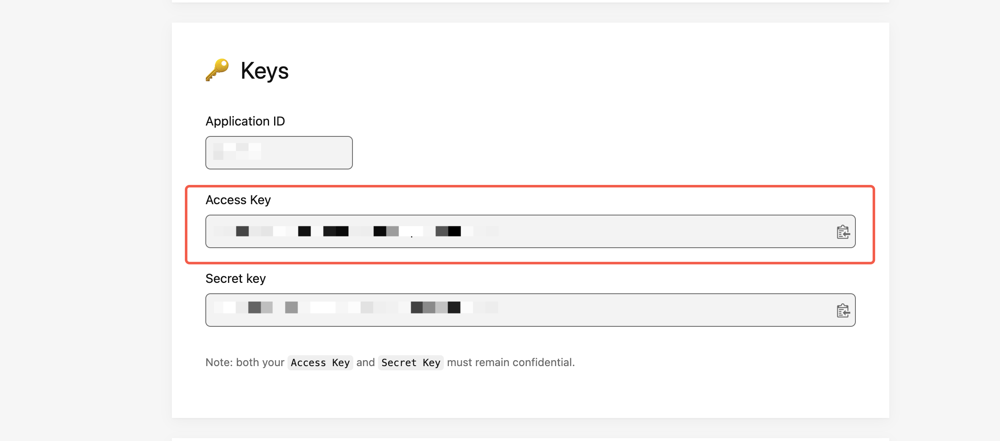
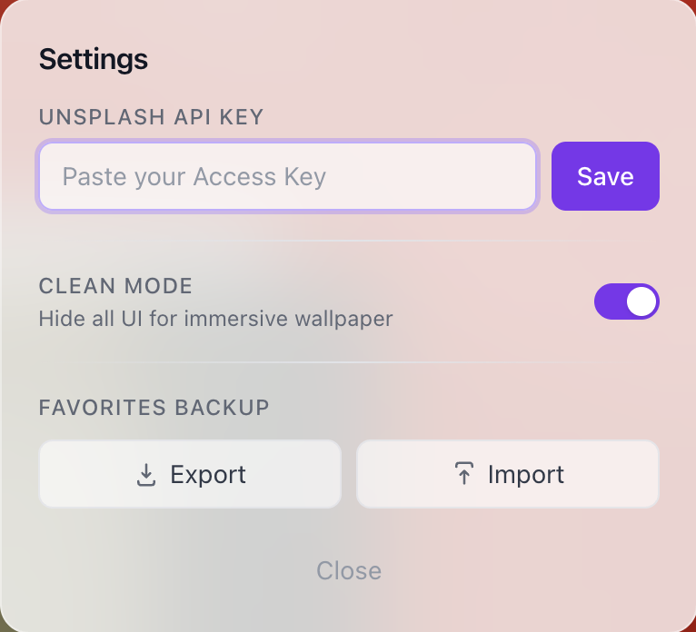

# Tabr

A Chrome Extension that replaces your new tab page with beautiful, high-resolution photos from Unsplash.

## Features

- Dynamic background photos on every new tab
- Favorite photos and browse your collection
- Carousel mode to rotate through your favorites
- Preloaded image queue for instant transitions
- Clock with smart greeting messages
- Debug panel for inspecting queue state

## Install from Chrome Web Store

[Install Tabr from the Chrome Web Store](https://chromewebstore.google.com/detail/tabr-beautiful-new-tab/jkplbdmkjpniomhdaikeaoihglhofgmb)

## Install from Source

```bash
git clone https://github.com/Moolan-d/tabr.git
cd tabr
npm install
npm run build
```

Then load the `.output` directory as an unpacked extension in Chrome (`chrome://extensions/` > Developer mode > Load unpacked).

## Configuration

Tabr uses the Unsplash API to fetch photos. A built-in trial key is included (limited to 10 requests). If you need more, you can configure your own key:

1. Go to [Unsplash Developers](https://unsplash.com/developers) and register as a developer.
2. Visit [Your Apps](https://unsplash.com/oauth/applications) and click on one of your applications to open its details page.
3. On the application page (`https://unsplash.com/oauth/applications/<app-id>`), copy the **Access Key** shown on the page.



4. Open a new tab in Chrome, click the **Settings** button (top-right corner), paste the key into the **Unsplash API Key** field, and click **Save**.



The new key takes effect immediately — no reload required.

## Development

```bash
# Build once
npm run build

# Watch mode - rebuilds on file changes
npm run dev
```

## Architecture

```
src/
├── providers/          # Photo source abstraction
│   ├── types.ts        # Photo, PhotoSource, FavoritePhoto interfaces
│   ├── unsplash.ts     # Unsplash PhotoSource implementation
│   └── registry.ts     # Source registration and management
│
├── services/           # Core business logic (no React dependency)
│   ├── cache.ts        # Chrome storage cache with TTL
│   ├── favorites.ts    # Favorites CRUD + random pick for carousel
│   ├── preload-queue.ts # Preloaded image queue (capacity 2, 10min TTL, 3 retries)
│   └── photo-service.ts # Central orchestrator, subscribe/notify state
│
├── hooks/
│   └── usePhotoService.ts  # React bridge via useSyncExternalStore
│
├── components/         # Presentational components
│   ├── Background.tsx
│   ├── BottomBar.tsx
│   ├── Clock.tsx
│   ├── DebugPanel.tsx
│   └── SettingsMenu.tsx
│
└── entrypoints/
    └── newtab/
        └── main.tsx    # Thin shell (~80 lines)
```

**Design principle:** React components only subscribe and render. All business logic, caching, and timers live in the service layer.

## Adding a New Photo Source

Implement the `PhotoSource` interface and register it:

```typescript
import type { PhotoSource, Photo } from './providers/types';
import { sourceRegistry } from './providers/registry';

const mySource: PhotoSource = {
  id: 'my-source',
  async fetchRandom(): Promise<Photo> {
    // fetch from your API
    return {
      url: '...',
      photographerName: '...',
      photographerLink: '...',
      originalLink: '...',
      source: 'my-source',
    };
  },
};

sourceRegistry.register(mySource);
```

No changes needed in the service or UI layers.

## CI/CD

- **CI:** Every pull request runs typecheck and build checks
- **Release:** Pushes to `main` trigger `semantic-release`, which analyzes commit messages and creates a new version automatically (`feat:` = minor, `fix:` = patch)
- **Publish:** New releases are zipped via `wxt zip`, uploaded to GitHub Releases, and submitted to the Chrome Web Store

To release manually, use the `workflow_dispatch` trigger in GitHub Actions with an existing tag.

## Tech Stack

- [WXT](https://wxt.dev/) - Browser extension framework
- React 18 + TypeScript
- Tailwind CSS
- Unsplash API
